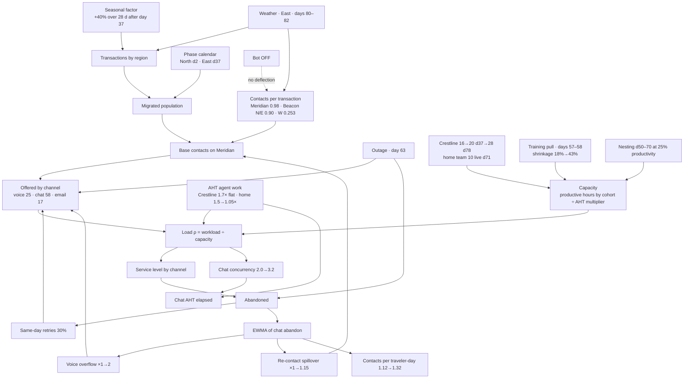

# HORIZON synthetic world — ground truth

**For validation only. The agent chain is not shown this file; it is used to check what the chain recovers.** The phase-1 check is in `docs/PHASE-1-VERIFICATION.md`.

Generated by `sim/generate.ts`, seed `20260720`. Day 1 = Monday 2026-07-20; day 120 = Monday 2026-11-16. Every number below is either a generator parameter (exact) or a value read from the generated ledgers for this seed (marked *observed*). Re-running the generator with the same seed reproduces them exactly.

## 1. The world in plain language

Larkspur Travel plans the Halcyon Group book. Halcyon's travelers contact Larkspur by voice, messaging/chat and email, 24/7. Until the migration, all three regions (North, East, West) sit on **Beacon**, an asynchronous messaging platform with no session timeout. The migration moves regions one at a time to **Meridian**, a synchronous chat platform with a ten-minute timeout. North goes first (day 2), East second (day 37), West (85% of the book) is planned for day 135 and is not live in the window.

The migrated regions are served by a vendor cohort, **Crestline Services**, from go-live, and by an in-house cohort, the **Larkspur home team**, from day 71 (training from day 36, nesting from day 50).

Seven mechanisms are planted. Each is a named parameter in `P` at the top of the generator.

1. **The ratio trap (composition).** Contacts per transaction on Beacon is 0.90 in North and East but 0.253 in West, so the whole-book ratio is 0.35 only because West is 85% of transactions and low-contact. On Meridian the migrated regions run 0.98 before any spillover. The plan of record carried 0.35. A benchmark of 0.20 from another book is post-bot; Halcyon's bot is switched off, so 0.20 is wrong by construction.
2. **The handle-time shift with no curve.** Crestline's AHT on Meridian is a level shift from day 2: voice 1.70× the Beacon baseline of 1,150 s (≈1,955 s), chat 1.45×, email 1.10×, flat for the whole window. The home team starts at 1.50× and runs a linear learning curve to 1.05× over eight weeks from day 71 (reaching ≈1.11× on day 120).
3. **The buffer that hides the shift.** Phase 1 is staffed with 16 Crestline heads against a true requirement of about 6, a ratio of 2.56× (*observed*, weekly-average productive hours ÷ requirement at 85% occupancy). Service level stays above 90% on every channel for 35 days even though handle time is 70% over plan.
4. **Growth without population.** After phase 2, whole-book transactions climb 40% over 28 days (seasonal, all regions including West), plateau to day 100, then ease to +25% by day 120. Phase 2 roughly doubles the migrated population but the plan held Crestline at 20 heads; chat service breaks in the second week after go-live. Once chat abandons rise, two feedbacks switch on with a lag (an exponentially weighted moving average of the chat abandon rate, α = 0.15, saturating at 0.22): voice contacts rise up to +100% (calls per transaction double, "voice as overflow") and contacts per transaction rise up to +15% (re-contact spillover). The loop is endogenous: more voice raises load, which lowers chat service, which raises abandons.
5. **A supply-side break that looks like demand.** On days 57–58 Crestline pulls six scheduled agents into a Meridian release training. Schedules are unchanged; in-day shrinkage jumps from 18% to 43% and productive hours fall about 30%. Because 30% of same-day abandons re-present, offered contacts also rise, so the day reads as a demand spike on any dashboard that does not show productive hours.
6. **Two exogenous shocks in the ledger.** Day 63: a Meridian outage. Chat offered ×1.5, voice ×1.6, email ×1.3 (retries), abandons floored at 55%/35%, transactions unchanged. Days 80–82 (tail on 83): severe weather in East. East transactions ×1.5/1.7/1.4, East contacts per transaction ×1.25, voice-skewed ×1.2; both transactions and contacts spike.
7. **Two definitions of AHT.** Chat `aht_elapsed_s` is elapsed session time; `aht_agent_work_s` is agent work time = elapsed ÷ effective concurrency (phase-0 column names were `aht_sec` / `aht_agent_sec`). Concurrency is 2.0 at low load and rises linearly to 3.2 as load ρ goes from 0.5 to 1.0. During the break, elapsed chat AHT climbs from ≈1,080 s to ≈1,730 s (*observed*, weekly) while agent-work AHT stays at ≈550 s. Voice and email have equal elapsed and agent-work AHT. Beacon messaging was asynchronous, so its elapsed time is hours and only its agent-work time (380 s) is comparable.

There is also one **reactive event** that is not in the design brief but the story needs it: after the break, Crestline adds 8 heads on day 78 at Crestline AHT (EV-010). It arrives one week after the home team goes live and two days before the weather event, so the recovery is confounded three ways on purpose.

## 2. The causal model

Read the DAG this way: transactions are exogenous (season, weather, phase calendar). Contacts follow transactions through a ratio that depends on platform and region. Load is contacts × AHT over capacity; service level is a logistic function of load; abandons feed back into offered (retries), into voice overflow, and into re-contact spillover. Nothing in the demand side responds to the plan; the plan only sets heads.

**Structural vs transitional.** Structural (they persist at steady state): the Crestline AHT level, the Meridian ratio of 0.98, the bot being off, the seasonal level. Transitional: the home-team learning curve, the overflow and spillover loops (they unwind once service recovers), the training pull, the outage, the weather.

**Confounders planted on purpose.** Phase 2 go-live (day 37) and the start of the seasonal ramp (day 37) coincide. The training pull (57–58) sits inside the collapse. The outage (63) sits inside the collapse and on a Sunday. The home-team go-live (71), the surge add (78) and the weather event (80–82) fall within nine days of each other, so the recovery cannot be attributed by eye.

## 3. Every planted effect

| # | Effect | Day(s) | Date(s) | Size (parameter) | Signature an analyst should see (*observed* for seed 20260720) |
|---|---|---|---|---|---|
| E1 | Phase 1 go-live, North | 2 | 2026-07-21 | 8% of transactions migrate; ratio 0.98 | Meridian contacts ≈100/weekday; contacts per migrated transaction ≈1.0–1.1 (weekends higher), not 0.35 |
| E2 | Crestline AHT level shift, no curve | 2→120 | | voice ×1.70, chat ×1.45, email ×1.10 on 1,150/380/420 s | Day 2 voice AHT 1,842 s, day 3 1,844 s (plan 1,150). Weekly Crestline voice AHT 1,900–2,020 s in every week to day 120 |
| E3 | Phase 1 buffer | 2–36 | to 2026-08-24 | 16 heads vs ≈6 required; 2.56× | ρ ≈ 0.35, occupancy ≈32%; chat SL never below 91%; the AHT miss costs nothing visible in SL |
| E4 | Home team classroom training | 36–49 | 08-24 → 09-06 | 10 heads, productive 0 | Supply rows: headcount_in_training 10, productive_h 0 |
| E5 | Phase 2 go-live, East | 37 | 2026-08-25 | migrated transactions ×1.875; heads 16→20 | Contacts ×1.85 vs the same weekday a week earlier; day-37 chat SL 83.9%, voice 91.4% ("lands on plan") |
| E6 | Seasonal ramp | 37–65, plateau to 100, ease to 120 | 08-25 → 09-22 | ×1.40 peak, ×1.25 at day 120 | Whole-book transactions 7,500/wk → 10,800/wk; West (still on Beacon) rises too, so it is not migration |
| E7 | Chat service break | ≈44 | 2026-09-01 | ρ crosses ≈0.8 | Day 44 chat SL 47.9%, voice 74.4%; day 51 chat 6.9%, voice 14.1% |
| E8 | Voice overflow (calls per transaction double) | 44→65, unwinds 85→110 | | overflow multiplier 1→2.0 (day 63) | Voice offered 38/day (day 36) → 135 (day 51) → 166 (day 71) with transactions +20–40%; voice share of contacts 25% → 40% |
| E9 | Re-contact spillover | 44→65, unwinds | | ×1.15 max | Contacts per migrated transaction 1.05 (wk 6) → 1.73 (wk 9) → 1.07 (wk 18); contacts per traveler-day 1.12 → 1.35 |
| E10 | Nesting | 50–70 | 09-07 → 09-27 | 10 heads at 25% productivity, AHT 1.5× | Home-team cohort rows appear with small handled and voice AHT ≈1,700 s |
| E11 | Training pull (supply regime break) | 57–58 | 09-14, 09-15 | shrinkage 18%→43%; productive −30% | Crestline productive 60 h vs 89 h the Monday before (68%); scheduled hours unchanged; chat abandons 72 and 80 vs ≈5 on day 56; offered up only via retries; transactions flat |
| E12 | Platform outage | 63 | 2026-09-20 (Sun) | chat ×1.5, voice ×1.6, email ×1.3; abandon floors 55%/35% | Chat offered 157 = 2.31× the same-weekday average; book transactions 1.09× the adjacent Sundays (flat within noise); chat SL 3.8% |
| E13 | Home team live, learning curve | 71→127 | 2026-09-28 → | 1.50× → 1.05× linear over 56 days; ≈1.11× at day 120 | Home-team voice AHT 1,730 s (wk 9) → 1,249 s (day 120); Crestline 1,950 s on the same day; blended voice AHT drifts down 1,950 → 1,700 while the vendor number does not move |
| E14 | Crestline surge add | 78 | 2026-10-05 | +8 heads at Crestline AHT | Productive hours step 660 → 1,120 h/wk; day-78 chat SL 63.8%, voice 86% |
| E15 | Weather, East | 80–82 (+83) | 10-07 → 10-09 | East tx ×1.5/1.7/1.4; ratio ×1.25; voice ×1.2 | East transactions 1.59× a week earlier; voice offered 308 on day 81; SL collapses again for three days despite the add |
| E16 | Recovery | 85→ | 2026-10-12 → | loops unwind | Week 13 chat SL 86%, voice 95%; week 15 onward ≥95%; ρ back to ≈0.35–0.45 |
| E17 | Two-definitions trap (chat) | all live days | | concurrency 2.0 → 3.2 with load | Chat elapsed AHT 1,080 s (wk 1) → 1,730 s (wk 9) → 1,000 s (wk 18); agent-work AHT 540–580 s throughout |
| E18 | Bot off | all | | no deflection | Ratio never approaches 0.20; EV-002 in the ledger |
| E19 | Beacon composition | −55→0 | 05-26 → 07-19 | N/E 0.90, W 0.253 | Beacon file: whole-book ratio 0.362, North 0.927 (*observed*) |

## 4. What the plan assumed (v000 plan of record)

| Assumption in the plan | What the plan used | What is true in this world | Consequence |
|---|---|---|---|
| Contacts per transaction | 0.35 (whole-book Beacon, carried) | 0.90 on Beacon for North/East; 0.98 on Meridian; up to 1.15 with spillover | Offered under-forecast by ≈2.8× before spillover, ≈3.6× at day 44 (plan 73.5 vs actual 262) |
| Benchmark cross-check | 0.20 from another Meridian book (post-bot) | Halcyon bot is off | The cross-check "confirmed" 0.35 as conservative; it is irrelevant |
| Voice AHT | 1,150 s (Beacon, carried as agent work) | Crestline 1,955 s from day 2, flat; home team 1,725 → 1,270 s | Voice workload per contact under-forecast by 1.7× |
| Chat AHT | 380 s (Beacon messaging agent work) | Crestline 551 s agent work; 1,080–1,730 s elapsed | 1.45× on the right definition; 2.8–4.5× if compared to the wrong one |
| Email AHT | 420 s | 462 s Crestline | Small; correctly ignorable |
| Transactions | Flat phase lines with a weekday shape, no seasonal ramp | +40% over four weeks after phase 2 | Under-forecast grows to 40% by day 65 |
| Population | Phase 1 = North 8%; phase 2 = North+East 15% | Same | Correct |
| Re-contact / overflow | None | Loops switch on once chat SL breaks | Not forecastable from the plan's inputs; visible from day ≈44 |
| Staffing | 16 Crestline heads phase 1 (hypercare); 20 heads for phase 2 ("phase 1 buffer absorbs East"); home team 10 from day 71 | True requirement ≈6 heads in phase 1, ≈14 at day 37, ≈25–30 at the peak | Phase 1 looks fine (2.56× buffer). Phase 2 breaks in week 2 |
| Occupancy for requirement | 85% | Achievable ≈92% at best in this world | Minor |
| Phase 3 | West to Meridian day 135; sizing from the same 0.35 and 1,150 s | West's own Beacon ratio is 0.253, and its Meridian ratio is unknown | Whatever the chain proposes must carry the bridge assumption explicitly |

## 5. What the chain should say, and when (design §8)

- **Day 3:** voice AHT for Crestline is 1.6–1.7× the carried baseline on two consecutive days; SL is unaffected because occupancy is ≈32%. Flag as a structural miss hidden by buffer.
- **Day 37:** phase 2 lands on plan for service, not for volume: contacts ×1.85 as expected from population, but 2.7× the plan's level.
- **Day 44:** growth without population. Three hypotheses with tests: seasonal transactions (test: West transactions on Beacon rise too), re-contact after abandons (test: contacts per traveler-day, and the lag structure abandon → offered), and channel overflow (test: voice share vs chat abandon rate, lagged). All three are true.
- **Days 57–58:** supply, not demand. Test: scheduled hours unchanged, productive hours −30%, transactions flat, offered rise explained by retries.
- **Day 63:** outage isolated from the trend by same-weekday comparison of transactions (flat) against contacts (×2.3).
- **The monthly plan:** phase 3 sizing must use West's own ratio (0.253 on Beacon), a bridge to Meridian graded [E], and the Crestline AHT level as structural.

## 6. Reproducibility

`bun run sim/generate.ts` from the repository root rewrites every file listed in `sim/README.md`. The RNG is mulberry32 seeded with `P.seed`; all noise is lognormal with the sigmas in `P.noise`. Changing any parameter changes the *observed* values in this document; the parameter values do not change.
