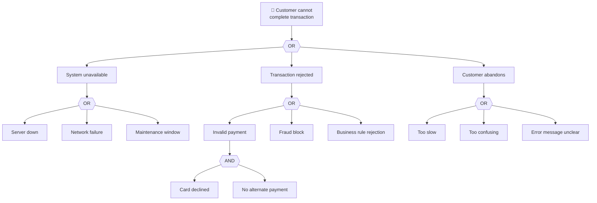
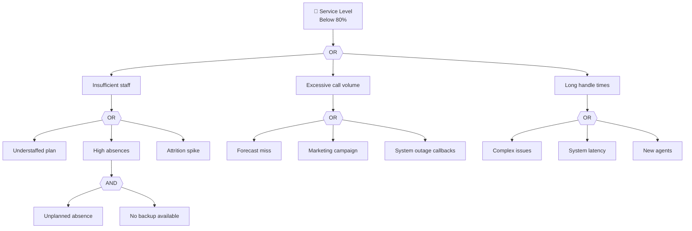

# Fault Tree Analysis (FTA) Workflow

Top-down decomposition of failures using Boolean logic.

---

## Prerequisites

- [ ] Clear "top event" (undesired outcome) defined
- [ ] System/process understanding for decomposition
- [ ] Domain experts for failure mode identification

---

## Workflow Steps

### Step 1: Define the Top Event

**Format:**
```
TOP EVENT: [Undesired outcome that triggers analysis]
```

**Examples:**
```
TOP EVENT: Customer cannot complete transaction
TOP EVENT: Service level drops below 80%
TOP EVENT: Agent unable to resolve customer issue
```

**Checklist:**
- [ ] Event is specific and unambiguous
- [ ] Event is observable/measurable
- [ ] Event represents significant impact

---

### Step 2: Decompose with Logic Gates

**Gate types:**

| Gate | Symbol | Meaning | When to Use |
|------|--------|---------|-------------|
| **AND** | ∧ | ALL inputs must occur | Multiple conditions required |
| **OR** | ∨ | ANY input causes output | Alternative failure paths |

**Decomposition questions:**
- "What conditions must be present for this to happen?" → AND gate
- "What are the different ways this could happen?" → OR gate

---

### Step 3: Build the Tree Structure

**Top-down approach:**

```
Level 0: TOP EVENT (undesired outcome)
    │
Level 1: Immediate causes (OR gate typically)
    │
Level 2: Contributing factors (AND/OR mix)
    │
Level 3: Root conditions (basic events)
```

**Continue until reaching:**
- Basic events (cannot be decomposed further)
- Events outside scope of analysis
- Events with no available data

---

### Step 4: Document in Mermaid

**Example fault tree:**


---

### Step 5: Identify Minimal Cut Sets

**Minimal cut set:** Smallest combination of basic events causing the top event.

**For the example above:**
```markdown
### Minimal Cut Sets (Single Point Failures)

Through OR gates, any single event causes top event:
- Server down
- Network failure
- Maintenance window
- Fraud block
- Business rule rejection
- Too slow
- Too confusing
- Error message unclear

### Minimal Cut Sets (Multiple Required)

Through AND gate:
- Card declined AND No alternate payment
```

**Interpretation:**
- Single-point failures are highest risk
- AND-gate paths require multiple failures (lower probability)

---

### Step 6: Assess Probabilities (Optional)

**If probability data available:**
```python
# Basic event probabilities
P = {
    'server_down': 0.001,
    'network_failure': 0.002,
    'maintenance': 0.01,
    'card_declined': 0.05,
    'no_alternate': 0.30,
    'fraud_block': 0.02,
    'too_slow': 0.03,
    'confusing': 0.02,
    'error_unclear': 0.01
}

# OR gate: P(A or B) = P(A) + P(B) - P(A)*P(B) ≈ P(A) + P(B) for small P
# AND gate: P(A and B) = P(A) * P(B)

P_system_unavailable = P['server_down'] + P['network_failure'] + P['maintenance']
P_invalid_payment = P['card_declined'] * P['no_alternate']  # AND gate
P_abandons = P['too_slow'] + P['confusing'] + P['error_unclear']

P_top_event = P_system_unavailable + P_invalid_payment + P['fraud_block'] + P_abandons
```

---

### Step 7: Map to Outcomes

**Link failure paths to CX/COST/EX:**

| Failure Path | Outcome Impact | Severity |
|--------------|----------------|----------|
| System unavailable | CX: Lost transaction, COST: Lost revenue | High |
| Transaction rejected | CX: Frustration, COST: Support calls | Medium |
| Customer abandons | CX: Poor experience, COST: Lost revenue | High |

---

### Step 8: Recommend Mitigations

**For each minimal cut set:**
```markdown
### Mitigation Recommendations

| Failure Mode | Current Control | Gap | Recommended Action |
|--------------|-----------------|-----|-------------------|
| Server down | Monitoring | No auto-failover | Implement redundancy |
| Card declined + No alternate | None | Single payment only | Add payment options |
| Too slow | None | No timeout monitoring | Add performance alerts |
```

---

## Output Template

```markdown
## Fault Tree Analysis: [Top Event]

### Top Event Definition
**Event:** [Undesired outcome]
**Impact:** [Business consequence]
**Outcome domain:** [CX/COST/EX]

### Fault Tree Diagram

```mermaid
[Fault tree diagram]
```

### Decomposition Table

| Level | Event | Gate | Parent | Type |
|-------|-------|------|--------|------|
| 0 | [Top event] | - | - | Top |
| 1 | [Cause 1] | OR | Top | Intermediate |
| 1 | [Cause 2] | OR | Top | Intermediate |
| 2 | [Sub-cause] | AND | Cause 1 | Basic |
| ... | | | | |

### Minimal Cut Sets

**Single-point failures (highest risk):**
1. [Basic event 1]
2. [Basic event 2]
3. [Basic event 3]

**Multi-event failures:**
1. [Event A] AND [Event B]
2. [Event C] AND [Event D]

### Probability Assessment (if applicable)

| Basic Event | Probability | Source |
|-------------|-------------|--------|
| [Event 1] | [P] | [Data source] |
| [Event 2] | [P] | [Data source] |

**Top event probability:** [Calculated P]

### Mitigation Recommendations

| Failure Mode | Risk Level | Recommended Mitigation |
|--------------|------------|------------------------|
| [Mode 1] | High | [Action] |
| [Mode 2] | Medium | [Action] |

### Outcome Impact

| Failure Path | CX | COST | EX |
|--------------|-----|------|-----|
| [Path 1] | [impact] | [impact] | [impact] |
| [Path 2] | [impact] | [impact] | [impact] |

---

⚠️ **HYPOTHESIS NOTE:** Fault tree identifies theoretical failure paths. Validate actual failure frequencies with data before prioritizing mitigations.
```

---

## Contact Center Example



---

## Common Pitfalls

| Pitfall | Prevention |
|---------|------------|
| Incomplete decomposition | Continue until basic events reached |
| Missing failure modes | Involve multiple domain experts |
| Wrong gate type | Verify: ALL required (AND) vs ANY sufficient (OR) |
| Circular logic | Events should not reference each other |
| Ignoring probability | Single-point failures often more critical than multi-event |
| Analysis paralysis | Limit tree depth based on available data |
