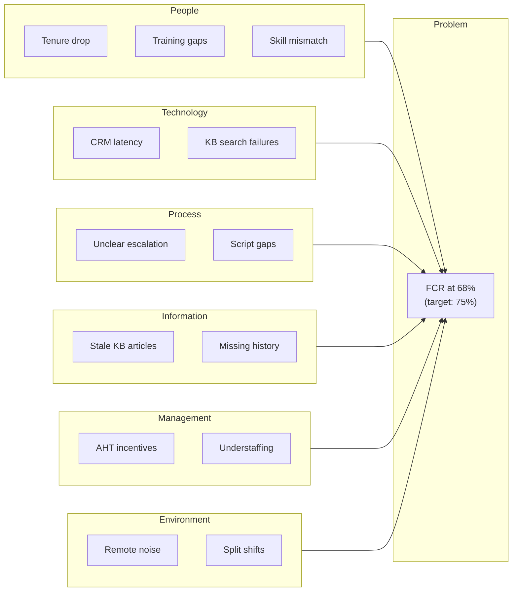

# Ishikawa (Fishbone) Diagram Workflow

Generate structured cause hypotheses using the Ishikawa/fishbone method.

---

## Prerequisites

- [ ] Clear problem statement (specific, measurable)
- [ ] Domain experts available for brainstorming
- [ ] Outcome linkage identified (CX/COST/EX)

---

## Workflow Steps

### Step 1: Define the Problem (Head of Fish)

**Format the problem statement:**
```
[Metric] is [current state] instead of [target state],
causing [impact] to [stakeholder].
```

**Example:**
```
FCR is 68% instead of 75%, causing repeat calls
that increase cost and frustrate customers.
```

**Checklist:**
- [ ] Problem is specific (not "service is bad")
- [ ] Problem is measurable (has a metric)
- [ ] Problem scope is defined (which team/channel/period)

---

### Step 2: Select Category Framework

**Load category context:**
```
load_context("RootCauseAnalysis/Context/IshikawaCategories.md")
```

**Recommended frameworks:**
| Problem Domain | Framework |
|----------------|-----------|
| Contact center | 6P (People, Technology, Process, Information, Management, Environment) |
| Manufacturing | 6M (Manpower, Machine, Method, Material, Measurement, Mother Nature) |
| Service quality | 4Ps (People, Process, Product, Place) |
| IT/Software | 6Cs (Code, Configuration, Capacity, Connectivity, Change, Competency) |

---

### Step 3: Brainstorm Causes by Category

For each category, ask:
1. "What factors in [category] could contribute to [problem]?"
2. "What has changed recently in [category]?"
3. "What does the data show about [category]?"

**Push for depth:**
- Minimum 2-3 causes per category
- Go beyond obvious answers
- Include sub-causes where relevant

**Document format:**
```markdown
### [Category Name]
- [Cause 1]: [Brief description]
  - Sub-cause: [If applicable]
- [Cause 2]: [Brief description]
- [Cause 3]: [Brief description]
```

---

### Step 4: Generate Fishbone Diagram

**Using Mermaid:**
```python
from root_cause_tools import generate_ishikawa_mermaid

categories = {
    "People": ["Tenure drop", "Training gaps", "Skill mismatch"],
    "Technology": ["CRM latency", "KB search failures"],
    "Process": ["Unclear escalation", "Script gaps"],
    "Information": ["Stale KB articles", "Missing customer history"],
    "Management": ["AHT incentives", "Understaffing"],
    "Environment": ["Remote noise", "Split shifts"]
}

mermaid_code = generate_ishikawa_mermaid(
    problem="FCR at 68% (target: 75%)",
    categories=categories
)
```

**Output example:**


**Alternative: Use Art skill for polished visual:**
```
/art fishbone diagram for FCR root cause analysis
```

---

### Step 5: Prioritize Causes

**Initial prioritization (before data validation):**

| Cause | Category | Impact (H/M/L) | Likelihood (H/M/L) | Evidence Available |
|-------|----------|----------------|--------------------|--------------------|
| [Cause 1] | [Cat] | [H/M/L] | [H/M/L] | [Yes/No/Partial] |
| [Cause 2] | [Cat] | [H/M/L] | [H/M/L] | [Yes/No/Partial] |
| ... | | | | |

**Selection criteria:**
- High Impact + High Likelihood = Investigate first
- Evidence Available = Can validate quickly

---

### Step 6: Map to Outcomes

**Link top causes to CX/COST/EX:**

| Cause | Primary Outcome | Secondary Outcome | Mechanism |
|-------|-----------------|-------------------|-----------|
| KB stale | CX | COST | Wrong info → repeat call |
| AHT incentives | COST | CX | Rushing → incomplete resolution |
| ... | | | |

---

### Step 7: Define Validation Path

**For each high-priority cause:**

```markdown
### Hypothesis: [Cause]

**Test approach:**
- Data source: [What data to analyze]
- Method: [Correlation, comparison, trend analysis]
- Success criteria: [What would confirm/reject]

**Escalate to CausalInference if:**
- Correlation found but causation uncertain
- Multiple confounding variables
- Intervention decision required
```

---

## Output Template

```markdown
## Fishbone Analysis: [Problem Statement]

### Problem Definition
**Current state:** [Metric at X%]
**Target state:** [Metric at Y%]
**Impact:** [Description of business impact]
**Outcome domain:** [CX/COST/EX] (primary)

### Fishbone Diagram
[Mermaid diagram or Art visual]

### Potential Causes by Category

| Category | Potential Causes | Priority | Evidence |
|----------|------------------|----------|----------|
| People | [list] | [H/M/L] | [avail?] |
| Technology | [list] | [H/M/L] | [avail?] |
| Process | [list] | [H/M/L] | [avail?] |
| Information | [list] | [H/M/L] | [avail?] |
| Management | [list] | [H/M/L] | [avail?] |
| Environment | [list] | [H/M/L] | [avail?] |

### Recommended Investigation Order

1. **[Highest priority cause]**
   - Why: [Rationale]
   - Test: [Validation approach]
   - Data needed: [Sources]

2. **[Second priority cause]**
   - Why: [Rationale]
   - Test: [Validation approach]
   - Data needed: [Sources]

3. **[Third priority cause]**
   - Why: [Rationale]
   - Test: [Validation approach]
   - Data needed: [Sources]

### Outcome Linkage

| Cause | Outcome Impact | Mechanism |
|-------|----------------|-----------|
| [Cause 1] | [CX/COST/EX] | [How it affects outcome] |
| [Cause 2] | [CX/COST/EX] | [How it affects outcome] |

---

⚠️ **HYPOTHESIS NOTE:** These are potential causes to investigate, not validated root causes. Test with StatisticalAnalysis, confirm causation with CausalInference before implementing countermeasures.
```

---

## Common Pitfalls

| Pitfall | Prevention |
|---------|------------|
| Stopping at symptoms | Ask "Why?" for each cause to go deeper |
| Category bias | Ensure all categories have causes or are explicitly ruled out |
| Confirmation bias | Include causes that contradict initial assumptions |
| Analysis paralysis | Limit to top 5-7 causes for investigation |
| Skipping validation | Never implement fixes without data confirmation |
